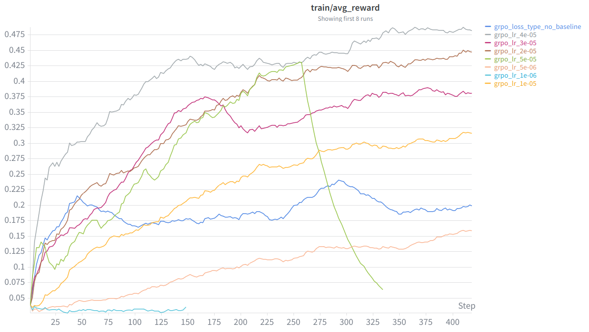

## math_baseline
format reward: 846 / 5000 = 16.92%
answer reward: 136
reward: 136 / 5000 = 2.72%

some of them is because the base model’s output, like: enclose <think></think> for each line of response, and some because the parser.

format reward is 1 but answer reward is 0 most because the answer is not right.

## sft_experiment
256 examples max accu 0.3320 in epoch 4
512 examples max accu 0.3560 in epoch 2
1024 examples max accu 0.3700 in epoch 4
full examples max accu 0.41 in epoch 4 and total batch 128
filter 1024 examples max accu 0.4141 in epoch 4

## grpo_learning_rate

best lr is 4e-5, the best lr range is in 2e-5 to 4e-5

https://wandb.ai/yzctzl_/cs336-assignment5-alignment-grpo/panel/x2agc3mr9

